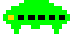
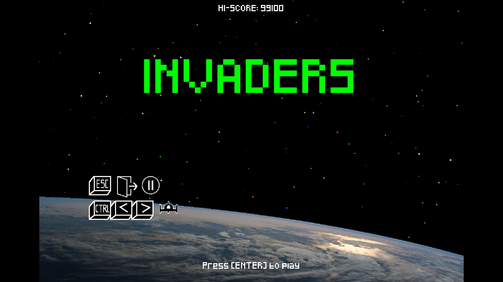
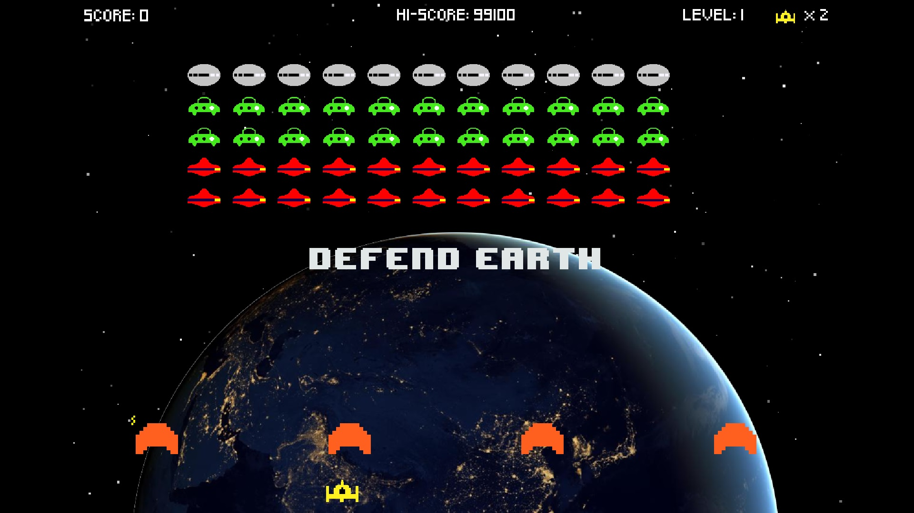
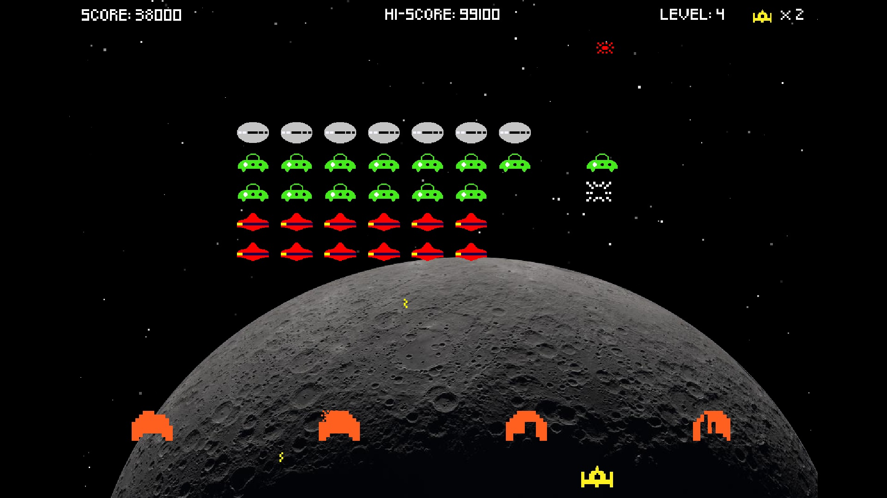

#  INVADERS
## Um jogo no estilo do antigo arcade "space invaders".

### Objetivo
- Este é meu primeiro jogo e meu objetivo é fazer um jogo completo com estagios, pontuação, vidas, tela inicial, salvar as iniciais, menu de pausa, tela final do jogo, efeitos sonoros, musica e tudo mais que um jogo precisa.
- Não foi usado IA, todos os algoritmos foram feitos por mim (apesar de funcional vários deles precisam de refatoração).

### Status do projeto
- Em desenvolvimento.  
No momento esta em fase beta, mas esta jogável com todos os estagios e funcionalidades.
- Ultima atualização em 24/09/2026.

### Gameplay
- O objetivo do jogo é destruir todos os alienigenas invasores e expulsa-los de vez do nosso sistema solar. Começando pela Terra e depois Lua, Marte, Jupiter, Saturno, Urano, Netuno. Cada planeta e satelite natural possui tres estagios, totalizando vinte e um estagios.
- O jogo acaba quando você perder suas 3 vidas ou quando a frota alienigena alcançar a parte inferior da tela.
- Você ganha novas vidas extras conforme sua pontuação aumenta.
- Controle do jogo:   
SETAS para controlar sua nave.  
CTRL (esquerdo ou direito) para atirar.  
ESC para dar pausa e sair do jogo.  
ENTER para iniciar o jogo.

### Funcionalidades  
- Já implementado:  
A maioria das funcionalidades, como graficos, menus, estagios, progressão de dificuldade, efeitos sonoros (emprestados), salvamento da pontuação e outros.
- Em andamento:  
No momento estou aprimorando a jogabilidade adicionando outras implementações que um jogo deste tipo normalmente não possui, para deixa-lo mais interessante.  
- Futuro:  
Aprimorar o menu principal  
Aprimorar a jogabilidade  
Inserir musica durante o jogo e refazer todos os efeitos sonoros.

### Tecnologias usadas
- Python versão 3.13.7  
- Modulo Pygame versão 2.6.1

### Screenshots
  
  
  

### Créditos
- Desenvolvimento, arte, programação e áudio:  
Paulo Fleury

### Observaçoes
- Nenhuma IA ajudou no desenvolvimento deste jogo.
- Muitos detalhes ainda vão ser implementados.

### Contato
- email: pnfleury@gmail.com  
- github: https://github.com/pnfleury

### Licença / License

© 2026 Paulo Nobrega Fleury Todos os direitos reservados / All rights reserved.

**Português:** Este repositório é público exclusivamente para fins de portfólio e demonstração. O código não pode ser copiado, modificado, redistribuído ou utilizado comercialmente sem autorização prévia por escrito.

**English:** This repository is public for portfolio and demonstration purposes only. The code may not be copied, modified, redistributed, or used commercially without prior written permission.